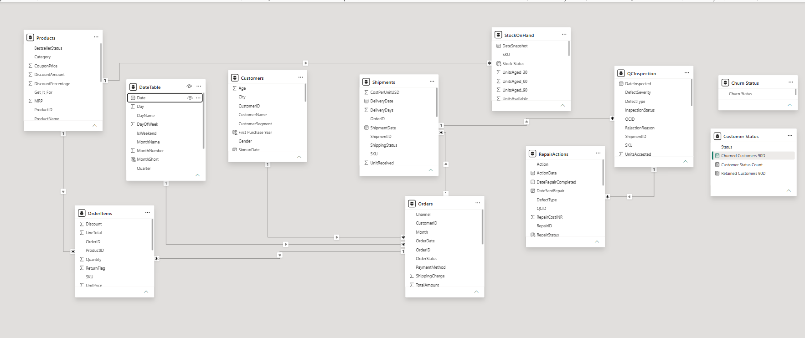

# ⌚ GIVA-Ecommerce-Customer-Churn-Retention-Analytics

## 📊 Project Overview

This Power BI project presents **five interactive dashboards** focused on **Sales Performance, Customer Churn & Retention, Operations, Inventory, and Product Analytics** for a GIVA-inspired jewellery e-commerce business.

It provides management-level insights into revenue performance, customer behavior, churn and retention, inventory availability, quality control, shipments, repairs, and operational efficiency.

> **Note:** Customer, order, shipment, inventory, QC, and repair transaction data used in this project is synthetically generated for analytics and demonstration purposes. Product/catalog information is based on publicly available GIVA-inspired product data.

---

---
## 🎯 Dashboards Included

### 1️⃣ GIVA Executive Overview

- Total Sales, Orders, Customers, and Average Order Value
- Active Customers and Customer Churn Rate
- Retention Rate Overview
- Monthly Sales Trend
- Sales by Channel
- Revenue by Customer Segment
- Top 5 Products by Sales
- Top 5 Products by Quantity Sold
- Order Status Distribution
- Payment Method Analysis
- QC Inspection Overview

### 2️⃣ GIVA Sales & Product Analysis

- Total Sales and Sales Growth %
- Previous Period Sales
- Total Orders and Average Order Value
- Total Quantity Sold
- Active Customers
- Return Rate
- Total Products and Average Rating
- Sales by Product Category
- Sales by Channel
- Customer Distribution by City
- Monthly Sales & Growth Trend
- New vs Returning Customers
- Top 5 Best-Selling Products

### 3️⃣ GIVA Customer Churn & Retention

- Total Customers
- Active Customers
- New Customers
- Returning Customers
- Customer Churn Rate
- Retention Rate
- Retention vs Churn Distribution
- New vs Returning Customers Trend
- Churned Customers by City
- Retention Rate by Customer Segment
- Customer Lifetime Value by Segment
- Churned Customer Analysis

### 4️⃣ GIVA Operations Dashboard

- Average Repair Days
- Average Repair Cost
- Total Shipment Cost
- Total Units Received
- Total Stock Available
- Average Delivery Days
- QC Failure %
- Repair Backlog
- Inventory Aging %
- Total Repairs Completed
- QC Inspection Status
- Warehouse-Wise Stock Overview
- Inventory Aging Analysis
- Repair Cost by Month
- QC Failure Reasons
- Vendor-Wise Shipment Summary
- Repair Status Distribution
- Low Stock Analysis

### 5️⃣ GIVA Inventory & Stock Analysis

- Total Stock Available
- Total Out-of-Stock Products
- Low Stock Products
- Dead Stock Units
- Inventory Aging %
- Stock Distribution by Category
- Stock by Warehouse
- Top 5 Products by Stock Quantity
- Low Stock Products by Category
- Product-Level Stock Monitoring
- Inventory Aging Analysis
- Warehouse-Level Inventory Comparison

---

## ⚙️ Tools & Technologies Used

- **Power BI Desktop** – Data modeling, visualization, dashboards, and reporting
- **DAX** – KPI calculations, customer analytics, churn, retention, sales, and inventory measures
- **Power Query (M)** – Data cleaning, transformation, and synthetic data generation
- **SQL** – Data analysis and business queries
- **Python** – Data generation, preprocessing, and analytical support
- **Excel / CSV** – Source and transformed datasets

---

## 💡 Key Insights
- Achieved **₹28.28M total sales**  
- Generated 5,000 orders across multiple e-commerce channels
- Maintained **90% on-time delivery rate**
- Recorded 6.13% QC failure rate, highlighting opportunities to reduce product defects  
- SLA compliance at **69.93%** with 422 repairs pending  
- Maintained inventory across 3 warehouses — Mumbai, Delhi and Suratns  

---

## 🧭 Interactive Filters
- Month / Quarter  
- Gender  
- City
- Warehouse  
- Vendor  
- Payment Method  
- Year

---

## 🖼️ Visuals Preview

---

## 🚀 How to Use
1. Clone or download this repository.  
2. Open the `.pbix` file in **Power BI Desktop**.  
3. Refresh or connect your own data source.  
4. Explore the visuals and filters interactively.

---

## 👩‍💼 Author
**Dhvani Kakadiya**  
📧 Email: dhvani1215@gmail.com.com  
🌐 LinkedIn: https://www.linkedin.com/in/dhvani-kakadiya-2811a8252

---

⭐ *If you like this dashboard, consider starring the repository to support more Power BI projects!* ⭐
